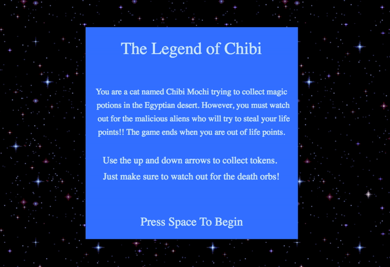

## The Legend of Chibi

[The Legend of Chibi](https://monicakornis.github.io/LegendOfChibi/) is a classic endless runner game, inspired by the likes of Sonic Dash, Temple Run, and Subway Surfers. The main goal of the game is to collect magic potions - pink potions are worth five points, blue potions are worth three, and yellow potions are worth one. If you accidentally collect one of the red death orbs, your points will decrease by 5.

 You must watch out for the malicious aliens who will shoot their laser beams at you! You'll initially start out with 20 points. Each time you get hit by a beam, your points will decrease by 5. The game ends when you're out of points!

## Technologies
  * Javascript
  * HTML Canvas

<!-- ## Wireframe
 -->

## Architecture
 * player.js - handles logic for player movement/velocity, calculates player's current points.
 * display.js - handles logic for creating and updating DOM elements.
 * ship.js - handles logic for creating ufo movement/entry.
 * token.js - handles logic for creating and placing potions in the game.
 * beam.js - handles logic for creating ufo lazer beams and their projectile motion.  
 * game.js - handles logic for game start and end
 * index.js - instantiates Game class

## Implementation Timeline
 * Day 1: Review HTML5/Canvas documentation, create display and player classes. Implement controls for player interaction.
 * Day 2: Implement logic for ship,beam, and token classes.
 * Day 3: Create game and index classes.
